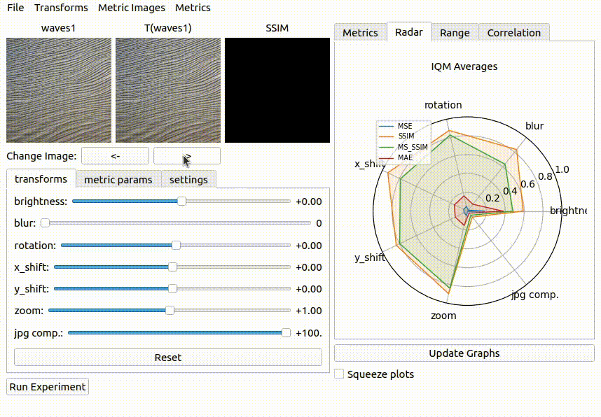

.. IQM-Vis documentation master file, created by
   sphinx-quickstart on Tue Mar 14 15:06:26 2023.
   You can adapt this file completely to your liking, but it should at least
   contain the root `toctree` directive.

IQM-Vis documentation
+++++++++++++++++++++
IQM-Vis is an image quality metric visualisation toolbox to facilitate visualising and evaluating image quality metrics (IQMs).

Quantitive Analysis
===================
IQM-Vis is able to provide a comprehensive analysis of IQMs through various quantitative graphs. These graphs offer practitioners a well-rounded understanding of how different IQMs perform under different scenarios without having to write any code to set up the testing procedure.

Qualitative Analysis
====================
Users are able to investigate the effects of distortions visually in two ways. Firstly by visually inspecting the transformed/distored image to make sure the distortion and parameters behave as expected. 
Secondly by analysing the spacial effects of IQMs, e.g. the image of an SSIM reponse. 

.. image:: images/params.gif
   :alt: Visual
   :align: center

Correlation to Human Perception
===============================
IQM-Vis facilitates the conduction, data management and analysis of the human perception experiments. See the "Running an Experiment" tutorial for further details on experiments.

Any image distortions which do not conform to the correlation can be selected for further analysis of the image properties. 

.. image:: images/correlation.gif
   :alt: Visual
   :align: center

Source Code
===========

You can visit the source code on `GitHub <https://github.com/mattclifford1/IQM-Vis>`_ .

.. toctree::
   :maxdepth: 1
   :caption: What is an IQM?:

   what-are-IQMs

.. toctree::
   :maxdepth: 1
   :caption: About IQM-Vis:

   about

.. toctree::
   :maxdepth: 1
   :caption: Getting Started:

   getting_started

.. toctree::
   :maxdepth: 2
   :caption: Tutorials:

   Tutorials

.. toctree::
   :maxdepth: 1
   :caption: Documentation:

   IQM_Vis.transformations
   IQM_Vis.metrics

Indices and tables
==================

..
  * :ref:`genindex`
* :ref:`modindex`

..
  * :ref:`search`
